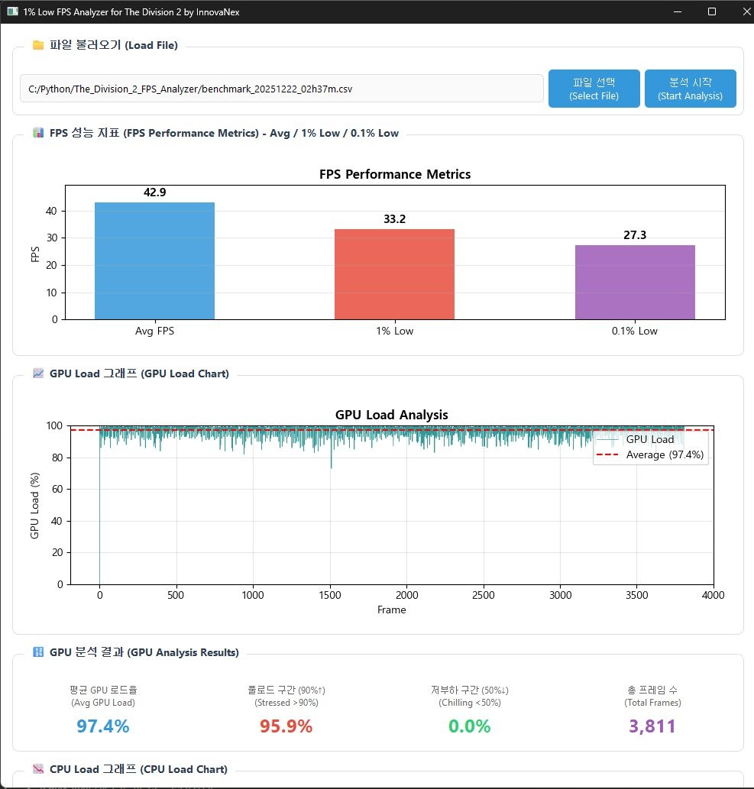

# 1% Low FPS Analyzer for The Division 2

GPU/CPU 로드와 FPS (평균, 1% Low, 0.1% Low)를 한 번에 확인하는 PySide6 기반 데스크톱 도구입니다. CSV를 불러오면 프레임타임으로 FPS를 계산하고, GPU/CPU 로드 차트 및 구간별 통계를 보여줍니다.

## 주요 기능
- CSV 로드 후 FPS 지표: Avg / 1% Low / 0.1% Low 계산 및 막대 그래프 표시
- GPU 로드 라인 차트 + 평균선, 고부하(>90%), 저부하(<50%), 총 프레임 수 표시
- CPU 로드 라인 차트 + 평균/고부하(>70%)/저부하(<30%)/최대값 표시 (CPU% 컬럼 있을 때)
- 한글/영문 UI 텍스트 동시 표기, 창 모드 실행 (콘솔 없음)

## 요구 사항
- Python 3.13 (venv 권장)
- 의존성: numpy, pandas, matplotlib, PySide6 (requirements.txt 참고)

## 설치
```powershell
# venv 생성 및 활성화
python -m venv .venv
.\.venv\Scripts\activate

# 필수 패키지 설치
pip install -r requirements.txt
```

## 실행 방법
```powershell
# venv 활성화 후
python FPS_Analyzer_GUI.py
```

## CSV 형식
- 헤더 2줄 스킵 후 데이터를 읽습니다 (`skiprows=2`).
- 필수 컬럼: `GPU%`, `Time 0.1mS`
- 선택 컬럼: `CPU%` (있으면 CPU 차트/통계 활성화)
- `Time 0.1mS` 는 0.1ms 단위 프레임타임이며, 내부에서 `frametime_ms = Time 0.1mS * 0.1`, `fps = 1000 / frametime_ms` 로 계산합니다.

## 빌드 (윈도우, 원파일, 콘솔 숨김, 아이콘 ME.ico)
PyInstaller 스펙 파일: FPS_Analyzer.spec
```powershell
# venv 활성화 후
python -m PyInstaller FPS_Analyzer.spec
```
- 출력: dist/FPS_Analyzer.exe
- 주의: 스펙에서 `unittest`/`distutils` 를 제외하지 말 것 (matplotlib/pyparsing 의존).

## 스크린샷


## 트러블슈팅
- 실행 시 `ModuleNotFoundError: unittest` 등 표준 라이브러리 누락: 스펙의 `excludes` 목록에서 제거 후 재빌드.
- 폰트 깨짐: matplotlib 설정이 Malgun Gothic을 사용합니다. 폰트가 없다면 다른 한글 폰트로 변경하거나 주석 처리하세요.
